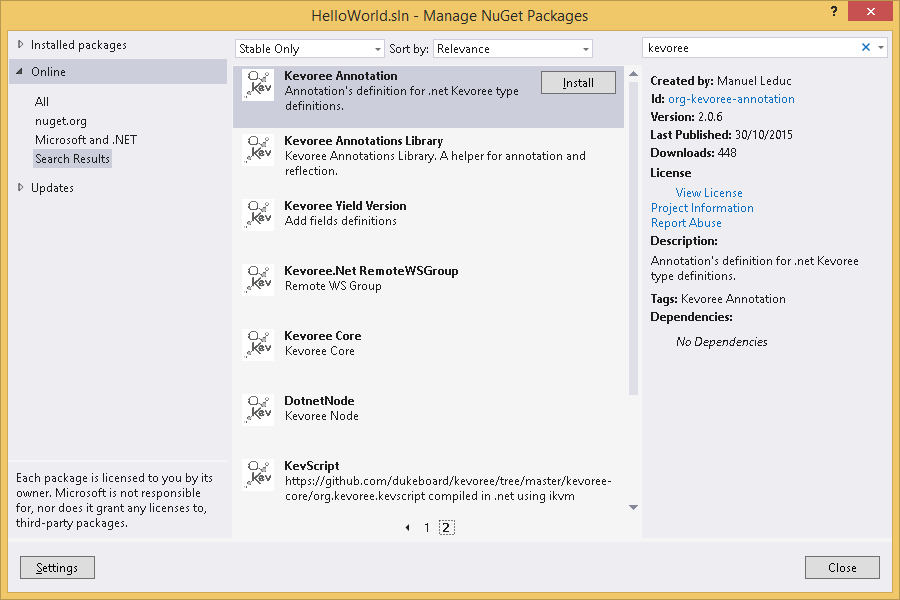
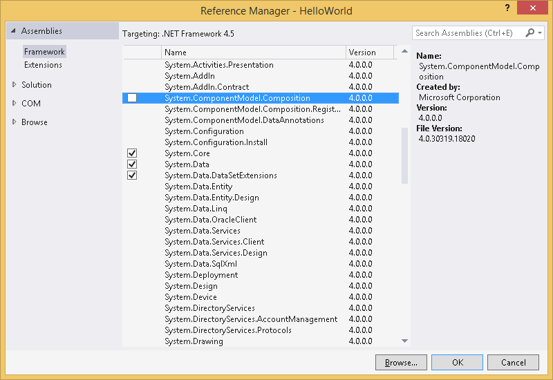

#### First step
In order to develop Kevoree Dotnet components you will need [Visual Studio](https://www.visualstudio.com/)  
Also [.NET 45](https://www.microsoft.com/fr-fr/download/details.aspx?id=30653) must be installed.

#### Dependencies
The project requires some Kevoree packages. These are easily installed from NuGet Package Manager. Perform a search for *kevoree* and install Kevoree Api and Kevoree Annotation packages.




You may also need to add a reference for SystemComponent.Model.Composition dll.



#### Purpose of the HelloWorld component
The `HelloWorld` component has a basic behavior to help users understand the concepts and code/project structures of Kevoree Dotnet.

**Component start:** supposed to say "Hello, world!"  
**Component stop:** supposed to say "Bye, world!"

This behavior is translated in a Kevoree component with this code:  
```csharp
using Org.Kevoree.Annotation;
using System;
using System.ComponentModel.Composition;

namespace Org.Kevoree.Library.Comp.HelloWorld
{
    [ComponentType]
    [Serializable]
    [Export(typeof(DeployUnit))]
    public class HelloWorld : MarshalByRefObject, DeployUnit
    {

        [Start]
        public void Start()
        {
            Console.WriteLine("Hello, world!");
        }

        [Stop]
        public void Stop()
        {
            Console.WriteLine("Bye, world!");
        }
    }
}

```

The Hello World project is [available as an example](https://github.com/kevoree/kevoree-dotnet-comp-helloworld).

#### How to compile the project
You can use msbuild or open the project in Visual Studio and compile it from here.

#### How to run the project
##### Publishing the component
Once developed, a component must be published in a registry before it can be started in a Kevoree instance.

To to so you can refer to [the official NuGet documentation](https://docs.NuGet.org/create/creating-and-publishing-a-package).

You are free to publish your code to any NuGet repository. My advice is to only publish stable component in the official NuGet repository (https://www.NuGet.org/) and to use a local registry for you developments (for example [ProGet](http://inedo.com/proget) is a nice free solution, fast and stable).

##### Releasing the component
The [Model Generator](https://github.com/kevoree/kevoree-dotnet-model-generator/releases/latest) allows you to publish a component to an http Kevoree registry or to save you component's model into a file.

My advice is to only publish stable components in the [official Kevoree registry](http://registry.kevoree.org/) and to generate files during development.

Both operations use the same executable :

```
.\kevoree-dotnet-model-generator.exe --help
kevoree-dotnet-model-generator 1.0.0.0
Copyright ©  2015

  --package.name                   Required. Nuget package name.

  --package.version                Required. Nuget package version (format =
                                   X.Y.Z).

  --typeDef.name                   Required. TypeDefinition name.

  --typeDef.version                Required. Type definition version (format =
                                   X.Y.Z).

  --typeDef.package                Required. Type definition package.

  --nuget.local.repository.path    Nuget local repository.

  --nuget.repository.url           (Default: https://packages.nuget.org/api/v2)
                                   Nuget remote repository.

  --output.path                    Required. (Default:
                                   http://registry.kevoree.org) Defines where
                                   the model will be published. If the value
                                   can be parsed as an url it will be used as a
                                   remote http registry. If the value can be
                                   parsed as a filesystem path it will be used
                                   as a directory path to the local kevoree
                                   registry.

  --help                           Display this help screen.
```

###### In a file
To publish a component in a file you just have to set the path to a file in the *output.path* option.

###### In a registry
To publish a component to a http Kevoree registry you can either ignore the option and the component will be published in the [official Kevoree registry](http://registry.kevoree.org) or a valid http url (you can, for example, deploy you own registry instances using [docker image](https://github.com/kevoree/docker-image-registry-replica)).

##### Defining the model
If your component has been published into an http Kevoree registry, it should be available in the "Registry Libraries" tab of the [online editor](http://editor.kevoree.org/).
If it has been generated into a file, you can merge into your model using the File -> Merge menu of the "Model Editor" tab.

Once your component is loaded, you just have to define and push your model to your nodes as usual.

#### Understand the HelloWorld component
Kevoree Dotnet is using attributes to let you specify what's what in your code.  
When Kevoree will have to **start** your component, it will call the method with the `[Start]` attribute

```dotnet
[Start]
public void Start()
{
    Console.WriteLine("Hello, world!");
}
```

When Kevoree will have to **stop** your component, it will call the method with the `[Stop]` attribute

```dotnet
[Stop]
public void Stop()
{
    Console.WriteLine("Bye, world!");
}
```

Kevoree Dotnet knows several other `attributes` but they will be explained in a later tutorial.

Kevoree Dotnet provides a logger by component injection using the KevoreeInject.
The ILogger interface is provided by the Logger API (Org.Kevoree.Log.Api in NuGet).

```dotnet
[KevoreeInject]
private Org.Kevoree.Log.Api.ILogger logger;
```
