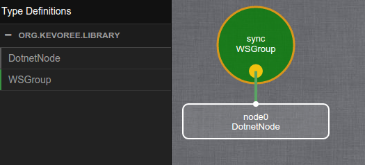
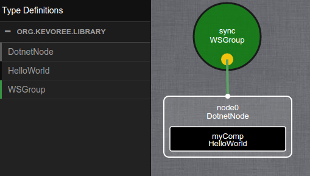

> :warning: This tutorial is the sequel of [2.HelloWorld++ - Java](https://github.com/HEADS-project/training/tree/master/2.Kevoree_Basics/2.HelloWorld++/dotnet), be sure to do the previous tutorial first.

#### Purpose of the Kevoree Web Editor
The Kevoree Web Editor is a web application that allows you to manage a Kevoree model graphically.
It is available at http://editor.kevoree.org

> A more complete documentation of the Kevoree Web Editor can be found [here](https://github.com/kevoree/kevoree-web-editor)

#### Using Model@Runtime concept
Kevoree uses the concept of Model@Runtime to apply reconfigurations on running systems.
Which means that if you want to modify, for instance, a dictionary attribute value and then apply the modification to an already running component, it will send the new model containing the modification to the targets.
This model will then be processed by the host platform (here, the JavaNode) and the appropriate actions will be triggered for each impacted components.

In other word, you change the value of `greetMessage` from `Hello, world!` to `Hello, HEADS!` within the Kevoree Web Editor.
You save your changes. You click the "Push button" to deploy this model on your running platform... and you watch the reconfigurations happening.

#### Add an action to the update event
In order to see the reconfiguration, you need to edit the `HelloWorld` component a bit so that it displays the `greetMessage` on each changes.
To do so, you will have to add a new method annotated with **@Update**
Kevoree will call the method on every component that has there attributes updated.

```dotnet
[Update]
public void Update()
{
    logger.Info("Update: " + greetMessage);
}
```

> NB: if you have 3 attributes, and each attributes is modified, the **update()** method will only be called **once**.

Now you have your component ready to react to update event.

#### Add a group for model sharing
If you want to allow your current project to share models (meaning that you want it to be reconfigurable), you will have to add a Kevoree group to the model and attach your node to this group.
In Kevoree, a **group** is another type of component that is dedicated only to model sharing (it allows two actions : pull which asks for the current model and push which send the new model to the members of the group).
A group can be connected to **nodes** (only), such as the DotnetNode.

In the Kevoree Standard Library you can find an implementation of a group named **WSGroup**. This group uses the **WebSocket** protocol in order to share the models across the different nodes attached to it.

You can attach a group to a group using the following KevSript :

```txt
add node0 : DotnetNode
add sync : WSGroup

attach node0 sync
```

#### Retrieve the model in the editor
First of all, starts a [dotnet boostrap](https://github.com/kevoree/kevoree-dotnet-core-bootstrap/releases/latest) with the default options.

This will start a model based on the following KevScript :

```txt
add node0 : DotnetNode
add sync : WSGroup
attach node0 sync
```

This will start a DotnetNode connected to a WSGroup.
In this configuration the WSGRoup will start a Websocket endpoint listening to the 9000 port (the default value ot the *port* parameter of the WSGroup).

The logs will looks like this :

```txt
13:51:23.902 Warn node2 Start
13:51:27.102 Debug node2 AdaptationModel [
AdaptationPrimitive [Type = AddInstance; RefPath = /groups[sync]; Ref2Path = ],
AdaptationPrimitive [Type = StartInstance; RefPath = /groups[sync]; Ref2Path = ]

]
13:51:27.118 Debug node2 Execute AddInstance
13:51:27.118 Debug node2 1.0.4-rc1 selected
13:51:27.118 Debug node2 Execute AddInstance : Org.Kevoree.Group.WSGroup:1.0.4-r
c1
13:51:31.984 Debug node2 Execute StartStopInstance start=true /groups[sync]
13:51:31.985 Debug Org.Kevoree.Group.WSGroup No master designated
13:51:32.000 Debug Org.Kevoree.Group.WSGroup WSGroup stopped
13:51:32.000 Debug node2 Adaptation succeeded
13:51:32.063 Warn node2 Bootstrap completed
13:51:32.102 Debug Org.Kevoree.Group.WSGroup Server started
```

> NB: When the last line is displayed WSGroup "sync" is listening on **0.0.0.0:9000**

You can then open your browser to the [Kevoree Web Editor](http://editor.kevoree.org) and click on **File** > **Open from node** > **Pull model**.



You can then look for the HelloWorld component and add it to the node.



This is the representation of your current running system.
The left panel shows the different TypeDefinition present in your model (HelloWorld, JavaNode, WSGroup)
and the 3 different shapes in the right panel represent the 3 instances you have defined in your KevScript:
  - node0 : JavaNode
  - sync : WSGroup
  - myComp : HelloWorld

If you drag'n'drop the "node0" shape away from the "sync" shape you will see that both are attached with a green link.
This is the representation of the `attach node0 sync` line in the KevScript and it means that there is a fragment of the WSGroup type running on the JavaNode node platform.

#### Edit your model using the editor
Each shape in the Kevoree Web Editor are clickable, and will open a window with some specific settings.
If you click on your component shape (the black one within the "node0" white shape) you will be able to see, and edit your dictionary attribute `greetMessage`


Do the following actions:
  - change the value of `greetMessage` to `Hello, HEADS!` and then save your changes
  - click on the node "node0" white shape and click the "Push" button

Now, switch back to the console where your `HelloWorld` project is running and you should see the update message

```txt
14:10:43.625 Info Org.Kevoree.Group.WSGroup Socket opened
14:10:43.666 Info Org.Kevoree.Group.WSGroup Message received
14:10:43.686 Info Org.Kevoree.Group.WSGroup Socket closed
14:10:44.686 Debug node0 AdaptationModel [
AdaptationPrimitive [Type = AddInstance; RefPath = /nodes[node0]/components[myCo
mp]; Ref2Path = ],
AdaptationPrimitive [Type = UpdateDictionary; RefPath = /groups[sync]; Ref2Path
= /groups[sync]/dictionary[0.55318851186893881448892463380]/values[master]],
AdaptationPrimitive [Type = UpdateDictionary; RefPath = /groups[sync]; Ref2Path
= /groups[sync]/dictionary[0.55318851186893881448892463380]/values[onConnect]],
AdaptationPrimitive [Type = UpdateDictionary; RefPath = /groups[sync]; Ref2Path
= /groups[sync]/dictionary[0.55318851186893881448892463380]/values[onDisconnect]
],
AdaptationPrimitive [Type = UpdateDictionary; RefPath = /groups[sync]; Ref2Path
= /groups[sync]/fragmentDictionary[node0]/values[port]],
AdaptationPrimitive [Type = UpdateDictionary; RefPath = /nodes[node0]; Ref2Path
= /nodes[node0]/dictionary[0.52610415127128361448892444522]/values[logLevel]],
AdaptationPrimitive [Type = UpdateDictionary; RefPath = /nodes[node0]/components
[myComp]; Ref2Path = /nodes[node0]/components[myComp]/dictionary[0.2081362919416
27861448892443574]/values[greetMessage]],
AdaptationPrimitive [Type = UpdateInstance; RefPath = /groups[sync]/dictionary[0
.55318851186893881448892463380]; Ref2Path = ],
AdaptationPrimitive [Type = UpdateInstance; RefPath = /groups[sync]/fragmentDict
ionary[node0]; Ref2Path = ],
AdaptationPrimitive [Type = UpdateInstance; RefPath = /nodes[node0]/components[m
yComp]/dictionary[0.208136291941627861448892443574]; Ref2Path = ],
AdaptationPrimitive [Type = UpdateInstance; RefPath = /nodes[node0]/dictionary[0
.52610415127128361448892444522]; Ref2Path = ],
AdaptationPrimitive [Type = StartInstance; RefPath = /nodes[node0]/components[my
Comp]; Ref2Path = ]
]
14:10:44.686 Debug node0 Execute AddInstance
14:10:44.686 Debug node0 1.0.3.0 selected
14:10:44.686 Debug node0 Execute AddInstance : Org.Kevoree.Library.Comp.HelloWor
ld:1.0.3.0
14:10:45.476 Debug node0 Execute UpdateDictionary
14:10:45.492 Debug node0 Execute UpdateDictionary
14:10:45.507 Debug node0 Execute UpdateDictionary
14:10:45.523 Debug node0 Execute UpdateDictionary
14:10:45.539 Debug node0 Execute UpdateDictionary
14:10:45.554 Debug node0 Execute UpdateDictionary
14:10:45.570 Debug node0 Execute StartStopInstance start=true /nodes[node0]/comp
onents[myComp]
14:10:45.570 Info Org.Kevoree.Library.Comp.HelloWorld Hello, HEADS!
14:10:45.570 Debug node0 Adaptation succeeded```

:thumbsup: You have successfully applied a runtime reconfiguration over your system.
