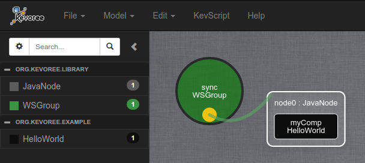

> :warning: This tutorial is the sequel of [2.HelloWorld++ - Java](https://github.com/HEADS-project/training/tree/master/2.Kevoree_Basics/2.HelloWorld++/java), be sure to do the previous tutorial first.

#### Purpose of the Kevoree Web Editor
The Kevoree Web Editor is a web application that allows you to manage a Kevoree model graphically.
It is available at http://editor.kevoree.org

> A more complete documentation of the Kevoree Web Editor can be found [here](https://github.com/kevoree/kevoree-web-editor)

#### Using Model@Runtime concept
Kevoree uses the concept of Model@Runtime to apply reconfigurations on running systems.
Which means that if you want to modify, for instance, a dictionary attribute value and then apply the modification to an already running component, it will send the new model containing the modification to the targets.
This model will then be processed by the host platform (here, the JavaNode) and the appropriate actions will be triggered for each impacted components.

In other word, you change the value of `greetMessage` from `Hello, world!` to `Hello, HEADS!` within the Kevoree Web Editor.
You save your changes. You click the "Push button" to deploy this model on your running platform... and you watch the reconfigurations happening.

#### Add an action to the update event
In order to see the reconfiguration, you need to edit the `HelloWorld` component a bit so that it displays the `greetMessage` on each changes.
To do so, you will have to add a new method annotated with **@Update**
Kevoree will call the method on every component that has there attributes updated.

```java
@Update
public void update() {
    Log.info("Update: {}", greetMessage);
}
```

> NB: if you have 3 attributes, and each attributes is modified, the **update()** method will only be called **once**.

Now you have your component ready to react to update event.

#### Add a group for model sharing
If you want to allow your current project to share models (meaning that you want it to be reconfigurable), you will have to add a Kevoree group to the KevScript file in `src/main/kevs/main.kevs` and attach your node to this group
In Kevoree, a **group** is another type of component that is dedicated only to model sharing (pull and push).
A group can be connected to **nodes** (only), such as the JavaNode.

In the Kevoree Standard Library you can find an implementation of a group named **WSGroup**. This group uses the **WebSocket** protocol in order to share the models across the different nodes attached to it.
To add this group to your project, just **add** some KevScript lines to `src/main/kevs/main.kevs`

```txt
// add an instance of WSGroup named "sync"
add sync : WSGroup
// attach your host node "node0" to the WSGroup group
attach node0 sync
```

#### Retrieve the model in the editor
First of all, compile and run the HelloWorld project

```sh
╭─leiko@kevtop /tmp/HelloWorld
╰─➤  mvn clean install kev:run
# ... many logs ...
00:00 INFO: Hello, world!
00:00 INFO: Starting /groups[sync]
00:00 INFO: WSGroup listen on 9000
00:00 INFO: JavaNode Update completed in 78 ms
00:00 INFO: End deploy result=true-71
00:00 INFO: Bootstrap completed
```

> NB: you can see a new log line that says that the WSGroup "sync" is listening on **0.0.0.0:9000**

Open your browser to the [Kevoree Web Editor](http://editor.kevoree.org) and click on **File** > **Open from node** > **Pull model**



This is the representation of your current running system.
The left panel shows the different TypeDefinition present in your model (HelloWorld, JavaNode, WSGroup)
and the 3 different shapes in the right panel represent the 3 instances you have defined in your KevScript:
  - node0 : JavaNode
  - sync : WSGroup
  - myComp : HelloWorld

If you drag'n'drop the "node0" shape away from the "sync" shape you will see that both are attached with a green link.
This is the representation of the `attach node0 sync` line in the KevScript and it means that there is a fragment of the WSGroup type running on the JavaNode node platform.

#### Edit your model using the editor
Each shape in the Kevoree Web Editor are clickable, and will open a window with some specific settings.
If you click on your component shape (the black one within the "node0" white shape) you will be able to see, and edit your dictionary attribute `greetMessage`


Do the following actions:
  - change the value of `greetMessage` to `Hello, HEADS!` and then save your changes
  - click on the node "node0" white shape and click the "Push" button

Now, switch back to the console where your `HelloWorld` project is running and you should see the update message

```sh
00:00 INFO: Bootstrap completed
03:23 INFO: No master specified, model will NOT be send to all other nodes
03:23 INFO: Push received, applying locally...
03:23 INFO: JavaNode received a new Model to apply from /groups[sync]
03:23 INFO: Update: Hello, HEADS!
03:23 INFO: JavaNode Update completed in 7 ms
03:23 INFO: End deploy result=true-7
03:23 INFO: WSGroup update result : true
```

:thumbsup: You have successfully applied a runtime reconfiguration over your system
