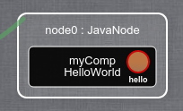

> :warning: This tutorial is the sequel of [3.Runtime_Reconfigurations - Java](https://github.com/HEADS-project/training/tree/master/2.Kevoree_Basics/3.Runtime_Reconfigurations/java), be sure to do the previous tutorial first.

#### Purpose of this tutorial
In a distributed system what you want to do is sending messages between your different components.  
With Kevoree, components can send messages to other components without implementing any communication protocol inside a component.  
Communications in Kevoree introduce 2 new concepts:
  - **Port**: you create them in your component, they can be of two types
    - Input - receives messages from outside in your components
    - Output - sends messages from your component to "outside"
  - **Channel**: this is where the communication protocol is implemented  
    Channels can implement any type of communication protocol, the only job they do, is receiving messages from the connected **output** ports and broadcasting them to the connected **intput** ports

The Kevoree Standard Library already provides different type of channels so you do not have to create a channel from scratch to get started.
In this tutorial, you will use a channel named **SyncBroadcast**  

In order to use those 2 new concepts, you will extend your **HelloWorld** component so that it will send messages on an **output port** named **hello**.
You will also add a SyncBroadcast to your model in order to handle the communications.
The component that will receive the messages will be one of the Kevoree Std Lib, named **ConsolePrinter** (which prints any received message to the console)

#### How to create an output port
In Kevoree Java, to declare a new **output port** you have to add a new field to your class with the annotation **@Output**

```java
package org.kevoree.example;

import org.kevoree.annotation.*;
import org.kevoree.api.Port;
import org.kevoree.log.Log;

@ComponentType
public class HelloWorld {

    @Output
    private Port hello;

    // ...
}

```

If you want to have a more "graphical" overview of what you have done:  
```sh
# run your project
mvn clean install kev:run
```
And open the Kevoree Web Editor to http://editor.kevoree.org/?host=127.0.0.1&port=9000 (if your WSGroup is running on default 127.0.0.1:9000)  

  

Your `hello` output port is the red-ish circle on the right.

#### How to use an output port
In order to send messages using the `hello` output port you can call the **send(...)** method

```java
@ComponentType
public class HelloWorld {

    private ScheduledExecutorService scheduledThreadPool = Executors.newScheduledThreadPool(1);

    @Output
    private Port hello;

    @Start
    public void start() {
        Log.info(greetMessage);

        // schedule the execution to be made every 5 seconds
        scheduledThreadPool.scheduleAtFixedRate(new Runnable() {
            @Override
            public void run() {
                // sends the greetMessage through "hello" output port
                hello.send(greetMessage);
            }
        }, 0, 5, TimeUnit.SECONDS);
    }
}
```

Alright, you have created a new output port for your component,
and you are sending the greet message every 5 seconds to whatever is connected to it.

#### Improve your KevScript
To see your `hello` output port in action, you have to add a channel and another component in your KevScript file

> Do not remove the current content of your KevScript, just add the following lines to it

```txt
// add an instance of SyncBroadcast named "chan"
add chan : SyncBroadcast
// bind the output port "hello" to "chan"
bind node0.myComp.hello chan

// add an instance of ConsolePrinter named "printer" to the host platform
add node0.printer : ConsolePrinter

// bind the intput port "input" to chan
bind node0.printer.input chan
```

#### Run your project
```sh
╭─leiko@kevtop /tmp/HelloWorld
╰─➤  mvn clean install kev:run
# ... many logs ...
00:01 INFO: Hello, world!
00:01 INFO: Starting /nodes[node0]/components[printer]
00:01 INFO: Starting /groups[sync]
00:01 INFO: WSGroup listen on 9000
00:01 INFO: Starting /hubs[chan]
00:01 INFO: JavaNode Update completed in 95 ms
00:01 INFO: End deploy result=true-93
printer>Hello, world!
00:01 INFO: Bootstrap completed
printer>Hello, world!
```

Every 5 seconds, you should see `printer>Hello, world!` in your console.

#### What just happened ?
You are using **SyncBroadcast** in your model, this channel is able to receive/send messages "locally", by locally I mean **only on the same** node platform.
It only works locally because SyncBroadcast does not use any client/server logic. It just tries to broadcast the messages to the connected input ports bound to it on the same node host.  
If you want to move the `printer : ConsolePrinter` component to another node, you will have to use another channel that is able to relay the communications over the network (see [5.Distributed_System](https://github.com/HEADS-project/training/tree/master/2.Kevoree_Basics/5.Distributed_System))  

#### Input port creation
In order to create an input port in Kevoree Java you also create an attribute with the type **Port** but annotated with **@Input**  
Because your HelloWorld component does not have to have an input port, I will just give the example from the **ConsolePrinter** component

```java
@ComponentType
public class ConsolePrinter {

    @KevoreeInject
    private Context context;

    @Input
    public void input(Object msg) {
        System.out.println(context.getInstanceName()+">"+msg);
    }
}
```

Every time the **ConsolePrinter** component receives a message, the `input(Object msg)` method is called with the `msg` parameter set with the content of the received message.  
You can see that the behavior is really basic: it uses the Java native `System` object to output the content to the console.

> `context.getInstanceName()` within a component gives you its name in the model, so according to your KevScript file, calling `context.getInstanceName()` in your HelloWorld component would return `myComp`  
> Here, it returns `printer` because you have set `add node0.printer : ConsolePrinter` in your KevScript
