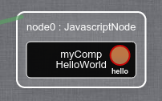

> :warning: This tutorial is the sequel of [3.Runtime_Reconfigurations - JavaScript](https://github.com/HEADS-project/training/tree/master/2.Kevoree_Basics/3.Runtime_Reconfigurations/js), be sure to do the previous tutorial first.  

#### Purpose of this tutorial
In a distributed system what you want to do is sending messages between your different components.  
With Kevoree, components can send messages to other components without implementing any communication protocol inside a component.  
Communications in Kevoree introduce 2 new concepts:
  - **Port**: you create them in your component, they can be of two types
    - Input - receives messages from outside in your components
    - Output - sends messages from your component to "outside"
  - **Channel**: this is where the communication protocol is implemented  
    Channels can implement any type of communication protocol, the only job they do, is receiving messages from the connected **output** ports and broadcasting them to the connected **intput** ports

The Kevoree Standard Library already provides different type of channels so you do not have to create a channel from scratch to get started.
In this tutorial, you will use a channel named **LocalChannel**  

In order to use those 2 new concepts, you will extend your **HelloWorld** component so that it will send messages on an **output port** named **hello**.
You will also add a LocalChannel to your model in order to handle the communications.
The component that will receive the messages will be one of the Kevoree Std Lib, named **ConsolePrinter** (which prints any received message to the console)

#### How to create an output port
In Kevoree JS, to declare a new **output port** you have to add a new field to your class using the naming-convention **out_**

```js
var HelloWorld = AbstractComponent.extend({
    toString: 'HelloWorld',

    // ...

    /**
     * Output port declaration - "hello"
     */
    out_hello: null
});

module.exports = HelloWorld;
```

If you want to have a more "graphical" overview of what you have done:  
```sh
# run your project
grunt kevoree
```
And open the Kevoree Web Editor to http://editor.kevoree.org/?host=127.0.0.1&port=9000 (if your WSGroup is running on default 127.0.0.1:9000)  

  

Your `hello` output port is the red-ish circle on the right.

#### How to use an output port
In order to send messages using the `hello` output port you have to use **out_hello** like a function. Kevoree JS will override @Runtime the reference of your `out_hello` field with a function so that you can use it that way:

```js
start: function (done) {
    this._super(function () {
        var greetMessage = this.dictionary.getValue('greetMessage');
        this.log.info(this.toString(), greetMessage);

        // - register a function to be executed every 5 seconds
        // - bind the context of that function to the context of HelloWorld instance
        //   so that we can call this.out_hello(...);
        // - keep a reference to the setInterval(...) id in order to clear it on
        //   component stop (see stop(...))
        this.id = setInterval(function () {
            // send the greetMessage every 5 seconds
            this.out_hello(this.dictionary.getValue('greetMessage'));
        }.bind(this), 5000);

        done();
    }.bind(this));
}
```

For this reason, you might want to give a real function definition to your `out_hello` field. By doing so, your IDE will probably give you some completion features when calling `out_hello`

```js
var HelloWorld = AbstractComponent.extend({
    toString: 'HelloWorld',

    // ...

    /**
     * Output port declaration - "hello"
     * @param {String} msg    Greeting message to send to others
     */
    out_hello: function (msg) { /* This will be overwritten @runtime by Kevoree JS */ }
});

module.exports = HelloWorld;
```

Alright, you have created a new output port for your component,
and you are sending the greet message every 5 seconds to whatever is connected to it.

#### Improve your KevScript
To see your `hello` output port in action, you have to add a channel and another component in your KevScript file

> Do not remove the current content of your KevScript, just add the following lines to it

```txt
// add an instance of LocalChannel named "chan"
add chan : LocalChannel
// bind the output port "hello" to "chan"
bind node0.myComp.hello chan

// add an instance of ConsolePrinter named "printer" to the host platform
add node0.printer : ConsolePrinter

// bind the intput port "input" to chan
bind node0.printer.input chan
```

#### Run your project
```sh
╭─leiko@kevtop /tmp/HelloWorld
╰─➤  grunt kevoree
# ... many logs ...
13:19:24  INFO   WSGroup          "sync" listen on 9000
13:19:24  INFO   HelloWorld       Hello, world!
>> Bootstrap model deployed successfully
printer>Hello, world!
printer>Hello, world!
```

Every 5 seconds, you should see `printer>Hello, world!` in your console.

#### What just happened ?
You are using **LocalChannel** in your model, this channel is able to receive/send messages "locally", by locally I mean **only on the same** node platform.
It only works locally because LocalChannel does not use any client/server logic. It just tries to broadcast the messages to the connected input ports bound to it on the same node host.  
If you want to move the `printer : ConsolePrinter` component to another node, you will have to use another channel that is able to relay the communications over the network (see [5.Distributed_System](https://github.com/HEADS-project/training/tree/master/2.Kevoree_Basics/5.Distributed_System))  

#### Input port creation
In order to create an input port in Kevoree JS you have to follow the naming-convention **in_**  
Because your HelloWorld component does not have to have an input port, I will just give the example from the **ConsolePrinter** component

```js
var ConsolePrinter = AbstractComponent.extend({
    toString: 'ConsolePrinter',

    in_input: function (msg) {
        console.log(this.getName() + '>' + msg);
    }
});
```

Every time the **ConsolePrinter** component receives a message, the `in_input(msg)` method is called with the `msg` parameter set with the content of the received message.  
You can see that the behavior is really basic: it uses the Javascript native `console` object to output the content to the console.

> `this.getName()` within a component gives you its name in the model, so according to your KevScript file, calling `this.getName()` in your HelloWorld component would return `myComp`  
> Here, it returns `printer` because you have set `add node0.printer : ConsolePrinter` in your KevScript
