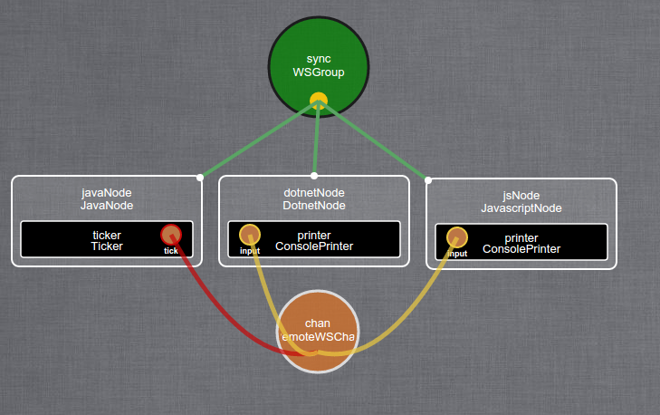

#### Purpose of this tutorial
You will not write a single line of Java nor JavaScript within this tutorial.
You will just use Kevoree's tools in order to run and manage a distributed system.  

  - **Kevoree Web Editor**:      Visualize, edit and deploy your model
  - **Kevoree Java Runtime**:    Runs the Java platform of your model (javaNode)
  - **Kevoree Node.js Runtime**: Runs the JavaScript platform of your model (jsNode)

The distributed system you are about to build and run is composed of:

  - **WSGroup**: to share the model between the 2 nodes  
  - **JavaNode**: to host a Ticker
      - **Ticker**: to send a random message every X seconds to ConsolePrinter
  - **JavascriptNode**: to host a ConsolePrinter and a WSMsgBroker
      - **ConsolePrinter**: to display the received message from Ticker to the console
      - **WSMsgBroker**: to start the server that WSChan will connect to  
        This component starts a server that acts as a message broker
  - **WSChan**: to relay the messages between the 2 components  
    This channel creates a client that connects to the specified server (in its dictionary attributes)

#### The big picture

*Graphical view of the complete system from the Kevoree Web Editor*
  


#### Create a base KevScript model

In order to use all the Kevoree tools and make some reconfigurations @Runtime,
you will start from a refined Kevscript model

```txt
// create the two platform nodes
add javaNode : JavaNode
add jsNode : JavascriptNode

// provide a network way to connect to those nodes
network javaNode.ip.lo 127.0.0.1
network jsNode.ip.lo 127.0.0.1

// create a group to share the model between the nodes
add group : WSGroup
// set the master node for the group to be the jsNode
set group.master = 'jsNode'
// attach the nodes to the group
attach javaNode, jsNode group
```

#### Run the Kevoree JS platform
Kevoree JS provides a command-line tool to start a Kevoree runtime easily.  
The module is named `kevoree-nodejs-runtime`, and it is available with `npm`

```sh
npm i -g kevoree-nodejs-runtime
```

> The `-g` argument tells `npm` to install the module "globally" so that you can use it as an executable just like any other commands

So now you should be able to use `kevoreejs`, which is the executable command-line client installed with `kevoree-nodejs-runtime`

```sh
╭─leiko@kevtop ~  
╰─➤  kevoreejs -v
5.1.1
```

Let's use `kevoreejs` to run the **jsNode** from your KevScript `starterModel.kevs`

```sh
kevoreejs -n jsNode --kevscript=/path/to/starterModel.kevs
```

  - **-n**: set the name of this node platform runtime
  - **--kevscript**: path to a KevScript model file to bootstrap on


### Run the Kevoree Java platform
Kevoree Java provides a **.jar** file to start a Kevoree runtime easily.  
You can download it [here](http://oss.sonatype.org/service/local/artifact/maven/redirect?r=public&g=org.kevoree.platform&a=org.kevoree.platform.standalone&v=RELEASE) or run the following command

```sh
wget http://oss.sonatype.org/service/local/artifact/maven/redirect?r=public&g=org.kevoree.platform&a=org.kevoree.platform.standalone&v=RELEASE -O kevoree.jar
```

Let's use this **.jar** to run the **javaNode** from your KevScript `starterModel.kevs`

```sh
java -Dnode.name=javaNode -Dnode.bootstrap=/path/to/starterModel.kevs -jar kevoree.jar
```

> N.B: if you use Windows, then you will probably have to enclose the arguments within double quotes '"'  
> `"-Dnode.name=javaNode"`

#### Use your distributed system
Now that you have 2 Kevoree runtimes running on your machine, you can visualize them using the Kevoree Web Editor  
http://editor.kevoree.org/?host=127.0.0.1


Click on the editor menu **KevScript**, remove the content (or append to it)

```txt
// add the Ticker on the Java platform
add javaNode.ticker : Ticker/5.2.2

// add the ConsolePrinter and the WSMsgBroker on the JS platform
add jsNode.printer : ConsolePrinter/5.2.2
add jsNode.broker : WSMsgBroker

// define on which port the broker will start
set jsNode.broker.port = '9050'

// add a WSChan to transmit the messages between the Ticker and the ConsolePrinter
add chan : WSChan/5.2.3-SNAPSHOT

// give the host:port of the broker to the chan
set chan.host = "localhost"
set chan.port = "9050"

// bind the ticker to the chan
bind javaNode.ticker.tick chan

// bind the printer to the chan
bind jsNode.printer.input chan
```

> Nb: you could have also done that graphically by going through **Model** > **Kevoree Registry Libraries** and merge whatever libraries you want from there.  
> And then use the drag'n'drop feature to add the needed components, and set the dictionary attributes using the form.


Now, click on the **jsNode** and **Push** your new model. You should see the adaptations taking part on both runtimes if you switch back to their console.

#### Conclusion
You have successfully built a distributed reconfigurable cross-platform system using **Kevoree** that sends messages from a Java ticker component to a JavaScript console printer component, using a fragmented (Java/Js) channel that communicates through the use of Web Sockets.
