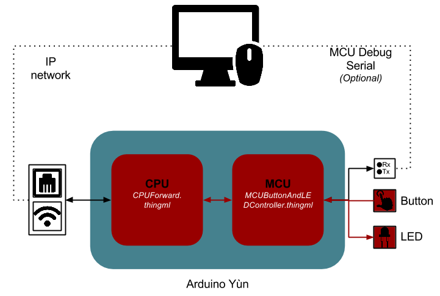

#Communication between CPU and MCU

This section shows an example of communication between the CPU and the MCU. This simple application proposes to turn on or off the led each times the button is pressed. But instead of linking directly the button and the led, all messages must transit by the CPU.

## Run the example

###CPU
* Compile CPUForward.thingml
* Cross compile the generated files
* Deploy CPUForwarderCfg on the CPU

###MCU
* Compile MCUButtonAndLEDController.thingml
* Deploy MCUButtonAndLEDController.pde on the MCU

