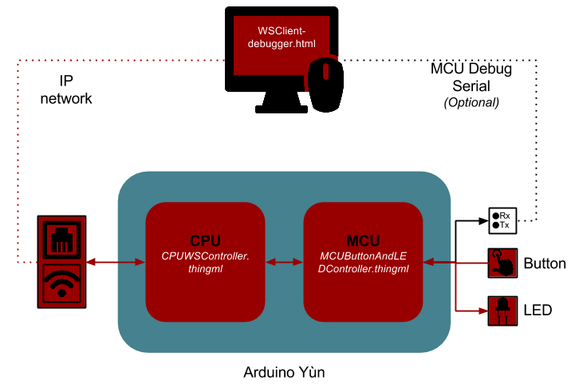

#Websocket

This section shows an example of Websocket communication, which allow to turn on and off the LED from your computer.

## Run the example

###CPU
* Compile CPUWSController.thingml
* Cross compile the generated files
* Deploy CPUWSControllerCfg on the CPU

###MCU
* Compile MCUButtonAndLEDController.thingml
* Deploy MCUButtonAndLEDController.pde on the MCU

###On your PC
* Open WSClient-Debugger.html on your browser
* Connect it with your Arduino Yùn, (by default port:9000, and protocol:ThingML-protocol)
* You can now send and receive websocket messages. Note that messages are serialized into an array of bytes, and each byte is represented by a three digit number.
Each message start with its ID on two bytes followed by its parameters. For example a message defined in ThingML as `message sendChar(c : Char) @code "35";` and send with `sendChar('c')` will be serialized like this: 000035099
* Send 000066 to turn the LED on and 000067 to turn it off

## Avanced Example

The UbberCPUWSController.thingml example shows how to generate some more advanced behaviour, such as generation of message to notify event like the connection of a new client, or a deconnexion. It also illustrates how to use unicast instead of the default broadcast. In order to run the example, just deploy it on the CPU instead of CPUWSControllerCfg.
