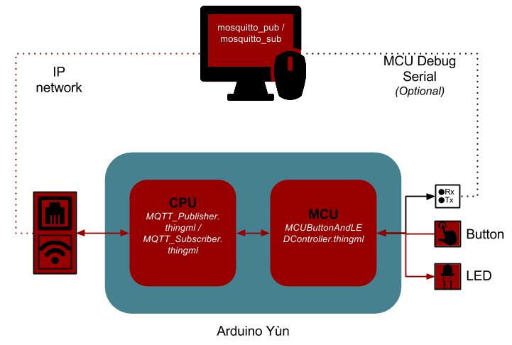

#MQTT

This section shows an example of MQTT communication, which allow to turn on and off the LED from your computer.



## Run the example

###CPU
* MQTT_Subscriber is supposed to turn on or off the LED when the appropirated messages are publish on the ThingML topic.
* MQTT_Publisher is supposed to publish any time the led is switched on or off by the button.
* UbberCPUMQTTController should subscribe to both the topic ThingML and ThingML2, and listen for instruction commanding to switch the LED on and off, and it publish on ThingML when the LED is switched on and on both topic when it's turned off

###MCU
* Compile MCUButtonAndLEDController.thingml
* Deploy MCUButtonAndLEDController.pde on the MCU

###On your PC

###Mosquitto
ThingML MQTT generation use a library called mosquitto (in its last supported version on Yun, à.15)
This library also includes a brocker and pub.sub clients which you can use from your computer if you wish in order to test your application.
Meanwhile, if you use another brocker it should works anyway. (If not please report the issue)

#### Install
```
#Brocker installation
sudo apt-get install mosquitto
#Client installation
sudo apt-get install mosquitto-clients
```

#### Pub/Sub
* You can use `mosquitto_pub -m msg -t topic` to publish on a topic (with a local brocker). (See Section 3 for more details on how messages are serialized.)
* You can use `mosquitto_sub -t ThingML` to subscribe to a topic (with a local brocker)

## Avanced Example

The UbberCPUMQTTController.thingml example shows how to generate some more advanced behaviour, such as multi topic subscription, and multi topic publication.
