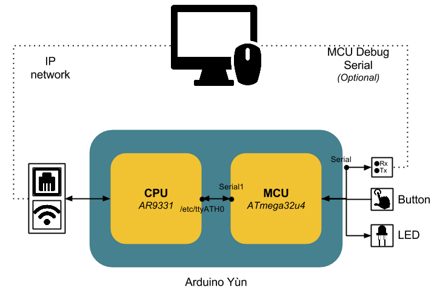

HEADS ThingML modelling language: Arduino Yun and External Communication
===

### 0. Prerequisites

**You should, at least, have done [Tutorial #1](https://github.com/HEADS-project/training/tree/master/1.ThingML_Basics)**. In other words, you should be comfortable with using the HEADS IDE and the ThingML language in particular, and should know how to generate, compile and run C code for POSIX and Arduino.

This tutorial has been written for a person working on a linux machine. It hasn't been tested on windows, but if you want to try, feel free to send your feedbacks.

### 1. Background

This tutorial will lead you through the learning of external communication generation with ThingML on Arduino Yùn.
Here you can find the hardware configuration that will be used to run the various application proposed in this tutorial.

You will need:
* An Arduino Yùn Board
* A LED
* A button

As you may know the Arduino Yùn Board contains two chips: an Atheros AR9331 (MIPS processor running openwrt, a linux  distribution for embedded systems), and an ATmega32u4 microcontroller. For the rest of this tutorial, the AR9331 will be refered as the CPU, and the ATmega32u4 as the MCU.

### Content of this tutorial

This tutorial is organized in the following way

1. HelloCPU: This section will lead you through the installation of the different tool you need to go further.
2. CPU - MCU Communication: This Section will detail how to create an application distributed between the two chips of the Arduino Yùn board.
3. Websocket: Learn how to generate a websocket server inside your application
4. MQTT: Learn how to generate an application that can connect with a MQTT brocker and publish or/and subscribe to MQTT topics

##Annotations
This tutorial use the debug annotation `@trace_level "i"` (which can be used on configurations, things, ports, and external connectors, with a level from 0 to 3). This will probably be subject to modifications.

It also use annotations aimed at generating code handling external communications. The complete list can be found [here](https://github.com/SINTEF-9012/ThingML/blob/master/compilers/c/src/main/resources/ctemplates/network_lib/ReadMe.md).

## Contact us

For any other issue feel free to contact any of us by email.

* HEADS project: Franck FLEUREY (franck.fleurey@sintef.no)
* This tutorial: Nicolas HARRAND (nicolas.harrand@gmail.com)

